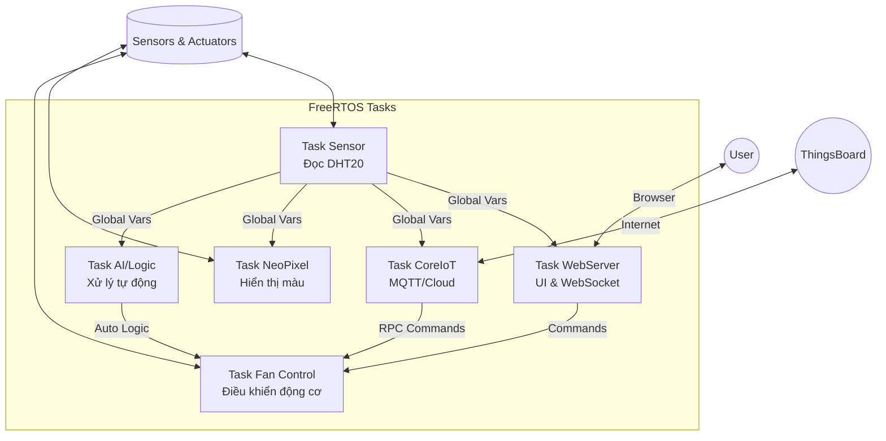

  

  # 🌪️ AIoT Smart Climate & Control System
  
  **Hệ thống Giám sát Môi trường & Điều khiển Thông minh Đa Nền tảng**
  
  
  
  
  
  

  

    Một giải pháp IoT toàn diện tích hợp <strong>Web Server cục bộ</strong>, <strong>Cloud Dashboard</strong>, và <strong>Trí tuệ nhân tạo (TinyML)</strong> để giám sát nhiệt độ/độ ẩm và điều khiển thiết bị làm mát tự động.
     
     
    <a href="#-demo-video"><strong>Xem Demo</strong></a> · 
    <a href="#-tính-năng-nổi-bật"><strong>Tính năng</strong></a> · 
    <a href="#-cài-đặt--hướng-dẫn"><strong>Cài đặt</strong></a>
  

---

## 🎥 Demo Video

> *Dưới đây là video demo thực tế hoạt động của hệ thống, bao gồm điều khiển qua Web Local, đồng bộ với CoreIoT và chế độ quạt tự động.*

  
  
<i>(Nhấn vào ảnh để xem video)</i>

---

## ✨ Tính Năng Nổi Bật

Hệ thống được xây dựng trên nền tảng **FreeRTOS**, đảm bảo khả năng đa nhiệm thời gian thực với độ ổn định cao.

### 1. 🌡️ Giám sát Môi trường Thông minh
* **Cảm biến DHT20:** Thu thập dữ liệu Nhiệt độ & Độ ẩm chính xác.
* **NeoPixel Visualizer:** Dải đèn LED RGB tự động đổi màu theo độ ẩm (Xanh -> Vàng -> Đỏ).
* **LED Status:** Đèn báo trạng thái nhấp nháy theo ngưỡng nhiệt độ cảnh báo.

### 2. 🌐 Web Dashboard (Local Control)
* Giao diện **Responsive**, đẹp mắt, lưu trữ trên bộ nhớ **LittleFS**.
* Đồng hồ đo (Gauges) cập nhật thời gian thực qua **WebSocket** (không cần tải lại trang).
* Cấu hình **Wi-Fi & Cloud Token** trực tiếp trên Web (lưu vào bộ nhớ Flash).
* Chạy song song 2 chế độ: **AP Mode** (Cấu hình) & **STA Mode** (Hoạt động).

### 3. ☁️ IoT Cloud Integration (CoreIoT)
* Kết nối nền tảng **ThingsBoard** qua giao thức **MQTT**.
* **Telemetry:** Gửi dữ liệu cảm biến định kỳ để vẽ biểu đồ lịch sử.
* **RPC (Remote Control):** Điều khiển thiết bị từ xa qua Internet với độ trễ cực thấp.

### 4. 🤖 Điều khiển Quạt AI (Hybrid Mode)
Hệ thống quạt thông minh với 4 chế độ hoạt động:
* **OFF:** Tắt hoàn toàn.
* **LEVEL 1:** Gió nhẹ (PWM thấp).
* **LEVEL 2:** Gió mạnh (PWM cao).
* **AUTO (AI Mode):** Tự động điều chỉnh dựa trên đánh giá **TinyML** hoặc Logic nhiệt độ/độ ẩm.

---

## 🛠️ Tech Stack & Phần Cứng

### Phần Cứng
| Linh kiện | Vai trò |
| :--- | :--- |
| **ESP32-S3 (Yolo UNO)** | Vi điều khiển trung tâm, xử lý AI & Wifi |
| **DHT20** | Cảm biến Nhiệt độ / Độ ẩm (I2C) |
| **NeoPixel Ring/Strip** | Hiển thị trạng thái độ ẩm |
| **Fan Module** | Quạt làm mát (Điều khiển PWM qua MOSFET/Driver) |
| **Buttons** | Nút nhấn vật lý (Thay đổi chế độ, Reset) |

### Công Nghệ Phần Mềm
* **Framework:** Arduino trên nền tảng PlatformIO.
* **OS:** FreeRTOS (Task Management, Semaphores, Mutexes).
* **Web:** HTML5, CSS3, JavaScript, AsyncWebServer, WebSocket, ArduinoJson.
* **Storage:** LittleFS (File System), Preferences (Cấu hình).
* **Protocol:** MQTT, HTTP, mDNS.

---

## 🏗️ Kiến Trúc Hệ Thống (Software Architecture)

Hệ thống hoạt động dựa trên các Task độc lập, giao tiếp an toàn qua Semaphore/Mutex:

